## 구조(ARCHITECTURE)

### 개요(Overview)

#### 시스템 개요

에어로스파이크는 분산,확장가능한 NoSQL입니다. 이것은 3가지 주요 목적으로 설계되었습니다:

* 요즘의 웹 규모 어플리케이션의 요구를 만족시키는 유연하고,확장가능한 플랫폼을 생성하기 위해서

* 기존 데이터베이스에서 기대하는 견고함과 신뢰성을 제공하기 위해서(즉,ACID)

* 운영 효율성을 제공하기 위해서(최소 설명서 관여)

[2011년에 VLDB의 절차](http://www.aerospike.com/docs/architecture/assets/vldb2011.pdf)에 처음으로 게시된 에어로스파이크 구조는 3계층으로 구성:

1. 클러스터 인식 [클라이언트 계층](http://www.aerospike.com/docs/architecture/clients.html)은 에어로스파이크 APIs와 트랙노드를 구현하고 데이터가 클러스터에 존재하는 곳을 아는 오픈 소스 클라이어트 라이브러리를 포함합니다.

2. 자기관리 [클러스터링](http://www.aerospike.com/docs/architecture/clustering.html)과 [데이터 분산 계층](http://www.aerospike.com/docs/architecture/data-distribution.html)는 클러스터 통신을 감독하고 페일오버,복제,크로스 데이터 센터를 자동화합니다.

3. 플래시 최적화된 [데이터 스토리지](http://www.aerospike.com/docs/architecture/storage.html) 계층은 확실하게 데이터를 DRAM과 플래시에 저장합니다.

##### 클라이언트 계층

에어로스파이크 "스마트 클라이언트"는 속도를 위해 설계되었습니다. 이것은 C,C#,Java,PHP에서 사용가능한 오픈 소스 링크 라이브러리로 구현되고,개발자들은 새로운 클라이언트 기여나 필요에 따라 그들을 변경해도 좋습니다. 클라이언트 계층은 다음과 같은 기능을 가집니다:

* 에어로스파이크 API,클라이언트-서버 프로토콜을 구현하고 직접 클러스터에 논의합니다.

* 노드를 추적하고 데이터가 저장되는 곳,바로 클러스터 설정의 변화의 학습 또는 노드가 오르내릴때를 압니다.

* 효율성을 위해 자신의 TCP/IP 연결 풀을 구현합니다. 또한 클러스터의 노드 실패 수준까지 오르지않는 트랜젝션 실패를 감지하고 데이터의 복사본을 지닌 노드에 그 트랜젝션을 재전송합니다.
* 확실하게 요청을 바로 데이터를 가진 노드에 전송하고 재시도하거나 필요에 따라 요청을 재전송합니다. 하나의 예는 클러스터가 재설정하는 것입니다.

이 구조는 트랜젝션 지연시간을 줄이고,클러스터에서 작업을 없애고 개발자를 위한 작업을 제거합니다. 이것은 또한 노드가 나오거나 사라질때 어플리케이션이 재시작할 필요가 없음을 보장합니다. 마지막으로, 이것은 설정하고 추가의 클러스터 관리 서버나 프록시를 관리하는 요구를 제거합니다.

##### 분산 계층

에어로스파이크 "아무것도 공유되지 않은" 구조는 자동 페일오버,복제 그리고 크로스 데이터 센터 동기를 지닌 데이터의 테라바이트를 확실하게 저장하도록 설계되었습니다. 이 계층은 선형적으로 크기를 조정하고 많은 [ACID 보장](http://www.aerospike.com/docs/architecture/acid.html)을 구현합니다. 이 분산 계층은 또한 모든 클러스터 관리 기능의 체계적인 자동화를 지닌 수동 작업을 제거하도록 설계되었습니다. 이것은 3개의 모듈을 포함:

* **클러스터 관리 모듈**은 클러스터의 노드를 추적합니다. 주요 알고리즘은 클러스터의 부분으로 간주되는 어느 노드를 결정하는 합의 투표 프로세스 같은 Paxos입니다. 에어로스파이크는 노드간의 연결을 감시하는 특별한 하트비트(능동 및 수동)를 구현합니다.
* 노드가 추가되거나 제거되고 클러스터 멤버쉽이 확인될때, 각 노드는 기본 인덱스 공간을 데이터 '조각'으로 나누고 소유자를 할당하는 분산된 해쉬 알고리즘을 사용합니다. 그 다음에 **데이터 이동 모듈**은 지능적으로 클러스터 노드간에 데이터의 분산의 균형을 맞추고, 시스템의 설정된 복제 요소에 의해 지정되도록 각 데이터의 조각이 노드와 데이터 센터간에 복제되는 것을 보장합니다.

> 분산은 시스템이 마스터없이 크기 조정하고 조각난 환경에서 요구되는 추가 설정의 필요를 제거하는,순수하게 알고리즘입니다.(Division is purely algorithmic, the system scales without a master and eliminates the need for additional configuration that is required in a sharded environment.)

* **트랜젝션 처리 모듈**은 데이터를 요구에 따라 읽고 쓰고 많은 일관성과 분리 보장을 제공합니다. 이 모듈은 1,2,3에 대해 책임이 있습니다.

 1. **동기/비동기 복제**: 즉각적인 일관성을 지닌 쓰기를 위해서, 이것은 데이터를 커밋하고 클라이언트에 결과를 반환하기전에 모든 복제본에 변화를 전파합니다.
 2. **프록시**: 클러스터가 재구성하는 드문 경우에 클라리어트 계층이 잠시 데이터 밖으로 나갈때, 이것은 확실하게 다른 노드의 요청을 프록시합니다.
 3. **복제 해결**: 클러스터가 분산된 후 회복될때, 이것은 다른 데이터의 복사본사이에 발생하는 모든 충돌을 해겹합니다. 해결책은 다음으로 구성됩니다.

   * 마지막 타임스탬프를 지닌 데이터가 기본인 경우,자동
   * 데이터의 두 복사본이 더 높은 수준의 해결을 위해 어플리케이션에 반환되는 경우,유저 기반

==클러스터링==

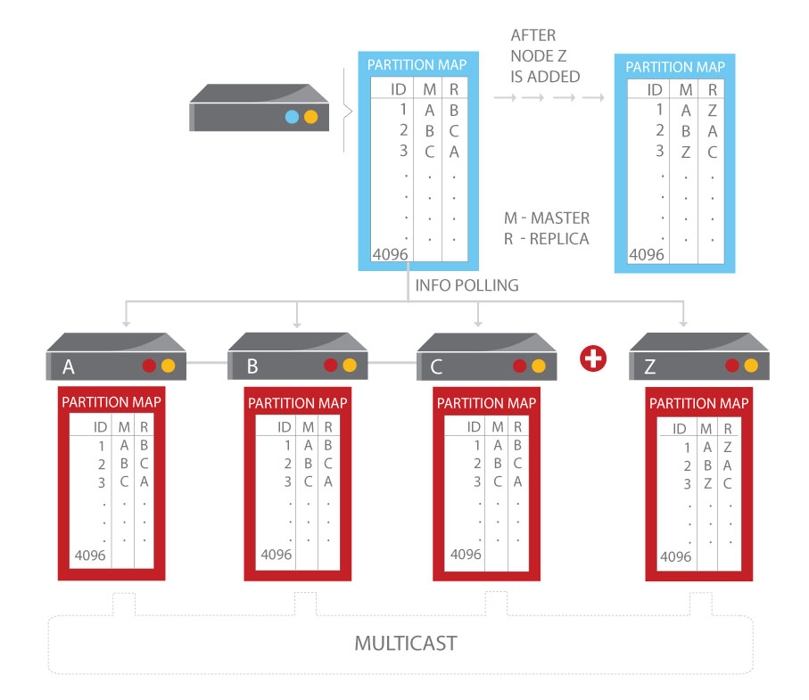

너가 첫번째 클러스터 업을 가질때, 너는 선택적으로 다른 데이터 센터에 추가 클러스터를 설치하고 [크로스 데이터 센터 복제](http://www.aerospike.com/docs/architecture/xdr.html)를 설정할 수 있습니다- 이것은 너의 데이터 센터가 내려갈때, 원격 클러스터가 유저의 최소한으로나 아무 방해없이 작업량을 인수받는걸 보장합니다.

##### 데이터 저장 계층

에어로스파이크는 스키마없는 [데이터모델](http://www.aerospike.com/docs/architecture/data-model.html)을 가진 키-값 저장소 입니다. 데이터는 의미상으로 RDBMS 시스템의 ==데이터베이스==와 비슷한,==네임스페이스==라고 불리는 정책 컨테이너로 구성되어 있습니다. 네임스페이스내에서, 데이터는 ==세트==(==테이블==과 비슷한)와 ==레코드==(==열==과 비슷한)로 세분화됩니다. 각 레코드는 세트에서 고유한 인덱스된 ==키==와 하나 이상의 레코드와 연관된 값을 보유하는 ==빈==(행과 비슷한)을 가집니다.

* 세트와 빈은 먼저 정의될 필요는 없지만, 최대 유연성을 위해 실행시간동안 추가될 수 있습니다.
* 빈의 값은 강하게 입력되고, 지원된 [데이터타입](http://www.aerospike.com/docs/guide/data-types.html) 중 하나를 포함할 수 있습니다. 빈은 스스로 입력될수 없어서, 다른 레코드는 다른 타입의 값을 가진 동일한 빈을 가질 수 있습니다.

인덱스([기본키](http://www.aerospike.com/docs/architecture/primary-index.html)와 [보조키](http://www.aerospike.com/docs/architecture/secondary-index.html))는 초고속 접근을 위해서 DRAM에 저장되고 값은 DRAM이나 더 효율적인 비용을 가지는 SSDs에 저장됩니다. 각 네임스페이스는 따로따로 설정될 수 있어서, 작은 네임스페이스는 DRAM을 이용하고 더 큰 네임스페이스는 SSDs의 비용 이익을 얻습니다.

> 데이터 계층은 특히 속도와 하드웨어 비용의 극적인 감소를 위해서 설계됩니다. 이것은 캐싱 계층의 요구를 제거하면서 모든 인메모리형태로 작동하거나 플래시 저장을 위해 고유의 최적화를 이용할 수 있습니다. 두 경우에, 데이터는 전혀 손실되지 않습니다.

* 100만 키는 오직 6.4GB만 차지합니다. 비록 키가 아무 크기 제한이 없더라도, 각 키는 효율적으로 오직 64바이트에만 저장됩니다.
* 기존,멀티 스레드된,멀티 코어 플래시 I/O와 **에어로스파이크 로그 구조된 파일 시스템**은 저수준의 SSD 읽기 및 쓰기 패턴을 이용합니다. 게다가, 디스크에 쓰기는 지연시간을 최소화하기 위해 큰 블록에서 작업됩니다. 이 메커니즘은 역사상 회전 디스크에 조정된 표준 파일 시스템을 건너뜁니다
* 또한 내장은 **스마트 조각 모음**과 **지능형 에빅터(Evictor)**입니다. 이런 프로세스는 DRAM에 공간이 있음을 보장하기 위해 같이 작업하고 그 데이터는 절대 손실되지 않고 안전하게 디스크에 기록됩니다.

  * 조각모음은 각 블록의 활성 레코드의 수를 추적하고 사용의 최소 수준보다 떨어지는 블록을 회수합니다.
  * 에빅터는 만기된 레코드를 제거하고 시스템이 세트 하이 워터 마크 이상으로 얻을때 메모리를 회수합니다. 유효 시간은 네임스페이스당 설정되고, 레코드의 연도는 이것이 마지막으로 개정된 시간에서 계산되고, 어플리케이션은 언제든지 기본 수명시간을 오버라이드하고 레코드가 쫓겨나지 않게 지정됩니다.

##### 에어로스파이크 조작

기존(분산되지 않은) RDBMS에서, 데이터베이스 소프트웨어를 설치후 너는 데이터베이스 스키마를 설정하고 데이터베이스와 테이블 정의를 생성할 수 있습니다. 에어로스파이크 데이터베이스를 가진 프로세스는 매우 다릅니다.  

분산된 데이터베이스에서, 데이터는 클러스터의 모든 서버중에 하나로 분산(분할)됩니다. 이것은 너가 단순히 서버로 로그하지 않고 한곳에서 너의 데이터의 전부를 접근하는 걸 의미합니다.  

에어로스파이크 데이터베이스에서, 너는 데이터베이스를 생성/관리:

* 초기 데이터베이스 설정을 구성함으로써, 에어로스파이크 문법에서, 데이터베이스는 네임스페이스라고 불리고 시스템을 설치할때, 클러스터의 어떻게 데이터베이스가 생성되고 복제되는지를 지정하는 설정된 각 네임스페이스를 가져야합니다. 너가 서버를 재시작할때 데이터베이스는 생성됩니다,여기에 나와있듯이.
* 어플리케이션을 통해 데이터베이스 작업을 수행함으로써. 데이터베이스 스키마는 너의 어플리케이션이 처음으로 너의 어플리케이션에 의해 사용되는 세트와 빈(테이블과 필드)을 언급할때 생성됩니다. 에어로스파이크 데이터베이스는 플렉스 스키마입니다-먼저 데이터베이스 스키마를 정의할 필요가 없습니다. 예를들어, 새로운 빈(필드)을 추가하기 위해서, 어플리케이션은 단순히 지정된 빈에 데이터를 저장하는 걸 시작합니다. 에어로스파이크 데이터베이스에서, 명령줄 인터페이스를 통한 DBA에 의해 보통 수행되는 작업은 어플리케이션을 통해 수행됩니다.
* 필요에 따라 설정 파일을 업데이트함으로써. 네임스페이스 파라미터를 바꾸기위해서, 너는 단순히 극적으로(재시작 없이)또는 새로운 설정 파일을 가진 서버를 재시작함으로써 설정 파일을 업데이트합니다.

에어로스파이크는 좋은 성능과 중복을 제공하기위해 필요한 노드의 수를 결정하도록 계획되고 설정되고, [용량 계획](http://www.aerospike.com/docs/operations/plan/capacity/index.html) 자원을 확인하세요.  

너는 [관리 지원 프로그램](http://www.aerospike.com/docs/amc/index.html)과 [감시하는 도구](http://www.aerospike.com/docs/operations/monitor/index.html)를 사용하는 클러스터의 노드를 감시하고 관리할 수 있습니다. 너는 클러스터에 노드를 추가하거나 업그레이드/서비싱을 위해 노드를 치우고 클러스터는 자동으로 자신을 재설정합니다. 노드가 실패할때, 클러스터의 다른 노드들은 작업량의 균형을 맞추고 거기에서 마지막 유저에게 최소한의 영향을 줍니다.

##### 어플리케이션 구축

네임스페이스가 생성될때, 에어로스파이크는 데이터베이스가 정확하게 데이터를 저장하는지 확인하는 도구를 제공합니다(데이터베이스의 작업을 확인하는 방법에 대한 설명서를 확인하세요). 그러나,생산 데이터베이스에서, 데이터는 클러스터에 분산됩니다. 데이터베이스 작업을 수행하기 위해서, 너는 너의 어플리케이션을 예시로 둔 스마트 클라이언트를 통해 작업해야 합니다.(In order to perform database operations, you need to work through the smart client that instantiates with your application.) 스마트 클라이언트는 작업에 영향을 끼치지 않고 클러스터에 데이터를 저장/회수하는 방법을 알고 인식하는 장소입니다.  

에어로스파이크는 빅 데이터 어플리케이션을 구축하는 여러가지의 언어로 APIs를 제공합니다. APIs의 개요는 클라이언트 가이드에 있습니다.  

너가 어플리케이션을 컴파일할때, API 라이브러리는 스마트 클라이언트와 함께 포함되어 있습니다. 스마트 클라이언트는 작동중인 클러스터 상태를 감시하는 스레드/프로세스로 주어진 시간에 데이터가 어디에 있는지를 결정하기 위해서 분리됩니다. 스마트 클라이언트의 위치 인식은 대부분의 경우에 데이터가 단일 홉의 노드에서 회수되는 걸 보장합니다.  

우리가 빅 데이터 어플리케이션을 참조할때, 우리는 일반적으로 웹서버에 위치하는 어플리케이션을 참조합니다, 이와 같이:

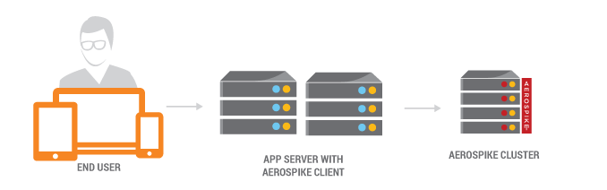

스마트 클라이언트는 데이터 분산의 자세한 내용을 무시하는 어플리케이션을 허용합니다. 더 자세한 내용을 위해서, 구조 가이드를 확입합니다.

> 이 문서에서, 우리는 용어 API와 통합된 너의 어플리케이션과 교환할 수 있는 클라이언트를 사용합니다-에어로스파이크는 또한 스마트 클라이언트와 통합됩니다.

### 데이터 관리

##### 개요

에어로스파이크는 향상된 키-값 작업을 지원합니다. 기본 put() 과 get() 작업에 비해, 에어로스파이크는 "CAS"(안전한 읽기/수정/쓰기) 작업, 인데이터베이스 카운터,그리고 멤캐시 작업을 지원합니다. 데이터는 빈(기존 관계형 시스템의 열과 유사한)으로 구성됩니다, 각 빈은 타입을 가집니다. 그 타입은 정수,스트링,바이너리 객체,또는 언어 직렬화 객체가 될 수 있습니다.  

데이터 관리 포함:

* 행이 입력된 키-값 작업과 증가와 같은 인데이터베이스 작업
* 고 가용성을 위한 데이터 복제
* 열 단위의 퇴거 정책
* 원활한 업그레이드와 클러스터 크기 변경
* 플래시(SSD) 최적화
* 크로스 데이터센터 복제(XDR)

에어로스파이크는 아래의 있는 걸 포함하기 위해 확장됨:

* 빈의 [복잡한 데이터 타입](http://www.aerospike.com/docs/guide/data-types.html)(중첩된 리스트와 맵)
* 스트링과 빈 수치 값이 인덱스되는 [쿼리](http://www.aerospike.com/docs/guide/query.html)와  균등(스트링 또는 수치) 또는 범위(수치)에 의해 조사된 데이터베이스
* 에어로스파이크의 어플리케이션 코드를 실행함으로써 확장되는 데이터베이스 처리를 허용하는 [사용자 정의 함수](http://www.aerospike.com/docs/guide/udf.html)
* 레코드 무리가 사용자 정의 함수와 동작하고 반환된 값을 집계하는 [집계](http://www.aerospike.com/docs/guide/aggregation.html)
* 빈이 최적으로 저장된 매우 큰(1MB 에서 1GB) 스택,리스트,또는 맵인 데이터 구조를 포함하는 [큰 데이터 타입](http://www.aerospike.com/docs/guide/ldt.html)

#### 데이터 모델

에어로스파이크는 데이터베이스에 저장된 데이터가 엄격한 스키마를 따르지 않는걸 의미하는 스키마없는 데이터모델을 가집니다.  

이것은 에어로스파이크에 데이터를 저장하는 방법의 유연성을 제공합니다-데이터에 대한 변경은 스키마 변경을 요구하지 않고 데이터베이스의 현재 데이터는 특정 스키마를 따를 필요가 없습니다.  

에어로스파이크의 스키마없는 모델은 플라이에 새로운 타입의 빈을 추가할 수 있습니다. 그러나 너는 여전히 빈 이름과 데이터를 저장하는 방법에 대해 훈련될 필요가 있습니다. 어플리케이션은 정확하게 작동하는 [쿼리](http://www.aerospike.com/docs/guide/query.html)와 [집계](http://www.aerospike.com/docs/guide/aggregation.html)를 위해서 항상 빈을 순서대로 사용해야 합니다.

##### 어떻게 데이터가 구성되는지

==저장소 구조==

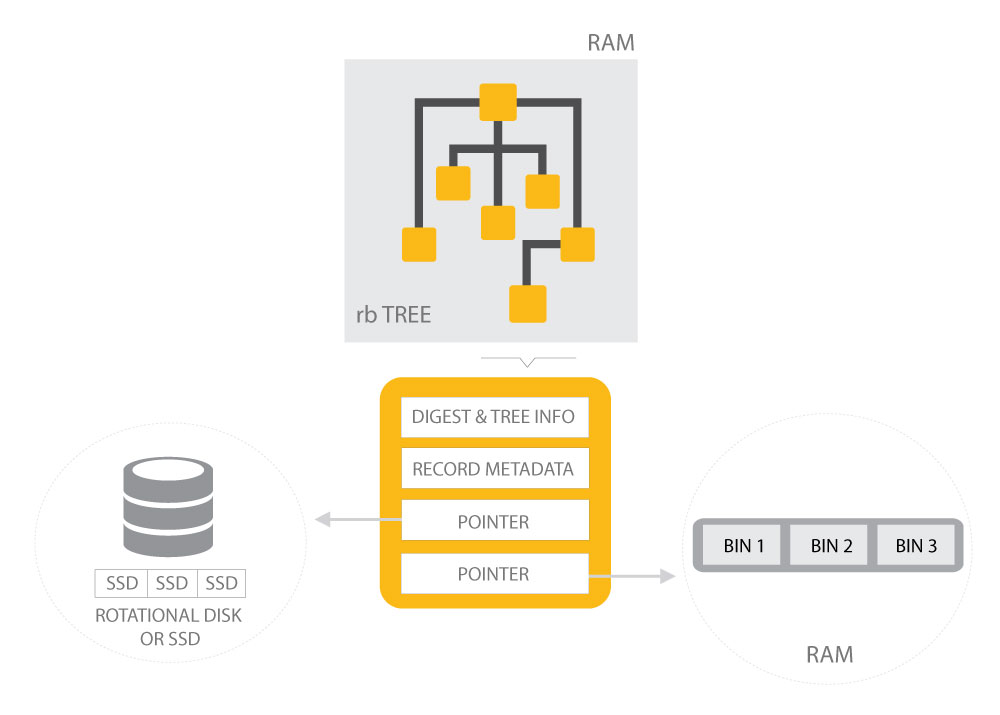

##### 네임스페이스

네임스페이스는 데이터를 위한 최상위 컨테이너입니다. 네임스페이스는 사실상 데이터베이스의 부분이거나 표준 RDBMS의 그들로 생각할수 있듯이 데이터베이스의 그룹일 수 있습니다(A namespace can actually be a part of a database or it can be a group of databases as you would think of them in a standard RDBMS)-너가 데이터가 저장되고 관리되는 방법에 관한 네임스페이스로 데이터를 모으기 때문에  

네임스페이스는 레코드,인덱스,그리고 정책을 포함합니다. 정책은 아래내용을 포함하는 네임스페이스의 행동을 지시합니다:

* 데이터가 저장되는 방법: DRAM 또는 디스크
* 얼마나 많은 복제본이 레코드를 위해 존재해야 하는지.
* 언제 레코드가 만기되는지.

네임스페이스를 위해 사용가능한 설정에 대한 자세한 내용을 위해선, [네임스페이스 설정](http://www.aerospike.com/docs/operations/configure/namespace/)을 참고하세요.  

데이터베이스는 어플리케이션의 필요에 의존하는 다른 정책을 지닌 각각의 여러 네임스페이스를 지정할 수도 있습니다. 네임스페이스는 데이터를 RAM의 조각,디스크 나 파일인 저장 장치에 바인드하기 때문에 물리적 컨테이너로 간주됩니다.  

(아래의)표 1에서, 우리는 ==ns1==과 ==ns2==라는 두 개의 네임스페이스를 정의합니다. ==ns1== 네임스페이스는 디스크에 레코드를 저장하는 반면에, ==ns2== 네임스페이스는 RAM에 레코드를 저장합니다.

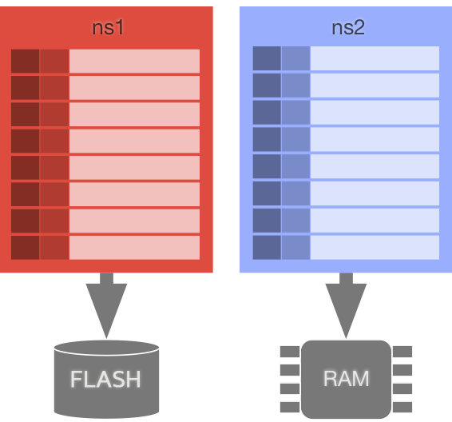

> 표1  
각각 다른 저장 엔진을 사용하는 두 네임스페이스가 정의됩니다

##### 세트

네임스페이스내에서, 레코드는 ==세트==라는 논리 컨테이너에 속할 수 있습니다. 세트는 컬렉션에 레코드를 그룹하는 어플리케이션 기능을 제공합니다. 세트는 그들이 속한 네임스페이스에 의해 정의된 정책을 상속받고 세트에 대한 구체적인 추가 정책을 정의할 수 있습니다.  

(아래의)표 2에서, 우리는 ==사람==과 ==장소==라는 두 개의 세트를 ==ns1== 네임스페이스에 추가합니다. 두 개의 세트는 타입에 기반한 레코드를 저장하는데 사용됩니다. 두개의 세트에 저장된 레코드에 더하여, 세트없이 네임스페이스에 일부 레코드가 있습니다.

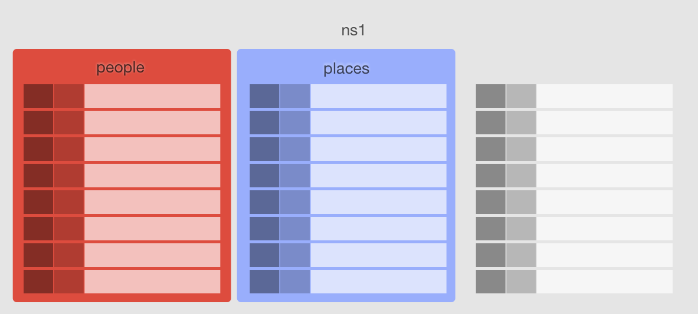 

 >표2  
==사람==과 ==장소==라는 두 개의 세트는 ==프리머리==라는 네임스페이스를 위해 정의됩니다. 프리머리는 또한 세트에 속하지 않은 레코드를 포함합니다.

##### 레코드

에어로스파이크 데이터베이스는 열 저장소라서 초점은 개별 레코드(표준 RDBMS에서 열로 불리는)에 있습니다. 레코드는 데이터베이스에서 저장의 기본단위입니다. 앞에서 언급된 것과 같이, 레코드는 네임스페이스내에서 세트나 네임스페이스에 속할 수 있습니다. 레코드는 네임스페이스에서 레코드를 유일하게 식별하는데 사용되는 키를 통해 주소를 지정합니다.  

레코드는 다음으로 구성됩니다:  

부품 | 묘사 
----|------ 
키 | 레코드는 다이제스트(digets)라고 불리는 키의 해쉬를 통해 주소를 지정합니다. 
메타데이터 | 메타데이터는 레코드 버전(세대)과 타임-투-라이브(time-to-live)(ttl)에 대한 정보를 제공합니다. 
빈(필드) | 빈은 기본 RDBMS의 필드와 동등합니다.

##### 키/다이제스트

어플리케이션에서, 각 레코드는 이것과 연관된 키를 가질 수 있습니다. 이 키는 어플리케이션이 레코드를 읽거나 쓰기 위해 사용하는 것 입니다.  

그러나,키가 데이터베이스에 전송될때,키(세트 정보와 함께)는 160 비트 다이제스트로 해시됩니다. 데이터베이스내에서, 다이제스트는 모든 작업에 대한 레코드의 주소에 사용됩니다.  

다이제스트가 주로 데이터베이스의 레코드 주소 지정을 위해 사용될때, 키는 주로 어플리케이션에서 사용됩니다.  

키는 아마도 정수,스트링 또는 바이트 값입니다. 이러한 값에 대한 자세한 내용은 [데이터 타입](http://www.aerospike.com/docs/guide/data-types.html)에서 볼 수 있습니다.

##### 메타데이터

각 레코드는 아래에 나와있는 것을 포함하는 레코드 자체에 대한 메타데이터와 함께 저장됩니다:

* **세대**는 레코드가 변경된 횟수를 반영합니다. 이 숫자는 읽기의 어플리케이션에 다시 전달되고 기록된 데이터가 마지막으로 읽은 이후 수정되지 않은 걸 확인하는데 사용됩니다.
* **타임-투-라이브(TTL)**은 레코드가 존재하는 시간을 지정합니다. 에어로스파이크는 자동으로 그 TTL에 기반한 레코드를 만기합니다. 레코드의 TTL은 쓰기 작업이 객체에서 실행될 때마다 증가됩니다.

##### 빈

레코드내에서, 데이터는 하나이상의 빈에 저장됩니다. 빈은 이름과 값으로 구성됩니다. 빈이 타입을 지정하지 않는 대신에 타입은 빈에 포함된 값에 의해 정의됩니다.  

이 동적 타이핑은 데이터 모델에 많은 유연성을 제공합니다. 예를들어, 레코드는 =="밥"==의 스트링 값을 가지는 =="아이디"==라는 빈을 포함합니다. 빈의 값은 항상 다른 스트링 값으로 변경할 수 있지만, 또한 정수 ==72==와 같은 다른 타입의 값으로 변경할 수 있습니다.  

또한, 네임스페이스 또는 세트 내의 레코드는 아마 매우 다른 빈의 컬렉션으로 구성됩니다. 레코드에 대한 스키마가 없어서, 각 레코드가 완전히 다른 세트의 빈을 가지는 것이 가능합니다. 또한, 빈은 레코드의 수명시간에 언제든지 추가되거나 제거될 수 있습니다.  

최적화된 스트링-테이블 구현 때문에 네임스페이스내에서 현재 사용하는 빈 이름의 수에 제한이 있습니다. 그 제한은 32K개의 고유한 빈 이름입니다.  

빈의 값은 [기본 지원된 타입](http://www.aerospike.com/docs/guide/data-types.html)과 [LDTs](http://www.aerospike.com/docs/guide/ldt.html) 중 하나가 될 수 있습니다.

#### 기본 인덱스

운영 데이터베이스에서, 가장 빠르고 예측 가능한 인덱스는 기본 키 인덱스여야 합니다. 이 인덱스는 데이터베이스의 열 정보를 위해 예측가능하고 제일 빠른 접근을 제공합니다.  

에어로스파이크의 기본 키 인덱스는 각 서버에서 분산된 트리 구조를 가진 분산된 해시 테이블 기술의 조합입니다. 네임스페이스(데이터베이스)에서 전체 키스페이스는 튼튼한 해시 기능을 사용하면서 ==파티션==으로 분할됩니다. 총 4096개의 파티션이 있고 클러스터의 노드에 동등하게 분산됩니다. 해싱과 파티셔닝에 대한 자세한 내용은 [데이터-분산](http://www.aerospike.com/docs/architecture/data-distribution.html)을 참고하세요.  

최하위 수준에서,인기있는 맴캐쉬 시스템에서 사용되는 데이터구조와 유사한 레드-블랙-인메모리 구조가 사용됩니다.  

기본 색인은 지정된 기본 키의 20바이트 해시(==다이제스트==라는 에어로스파이크 문법에서)에 있습니다. 일부 레코드의 키 크기를 확장하는 (예를들어,고유한 8 바이트 키를 가지는)동안에, 입력 키 크기나 입력 키 분산에 관계없이 코드가 예상한대로 작업하기 때문에 이것은 유익합니다.  

단일 서버가 실패할때,두번째 서버에 인덱스를 바로 사용할 수 있습니다. 실패된 서버가 다운되어 있을때, 데이터는 재균형을 시작합니다. 데이터의 균형을 재조정하는동안에,데이터가 도착할때 인덱스는 새로운 서버에서 계산됩니다.

##### 인덱스 메타데이터

각 인덱스 항목은 현재 64 바이트를 필요로 합니다. 다이제스트와 마찬가지로 다음의 메타데이터는 또한 인덱스에 저장됩니다.

* **쓰기 세대** - 또는 벡터 클럭: 이것은 시스템의 키에 모든 업데이트를 추적합니다. 이것은 충돌 업데이트를 해결하는동안에 사용됩니다
* **빈 시간** : 이것은 시스템의 키 수명을 추적합니다. 이것은 키가 만료된 시간이고 퇴거 서브 시스템에 의해 사용됩니다.
* **저장소 주소**: 데이터를 위한 저장소(인메모리와 지속성 모두)의 위치

##### 인덱스 지속성

처리량을 유지하기 위해서, 기본 인덱스는 저장소에 커밋되지 않습니다- 오직 RAM에만. 이것은 매우 높은 성능과 고도로 병렬하는 쓰기를 허용합니다. 데이터 저장소 계층은 또한 저장소를 사용하지 않도록 구성됩니다.  

에어로스파이크 서버가 시작할때, 이것은 저장소의 데이터를 통해 지나가고 모든 데이터 파티션을 위해 기본 인덱스를 생성합니다.

###### 빠른 재시작

다운타임없이 클러스터의 빠른 업그레이드를 지원하기 위해서, 에어로스파이크는 "빠른 재시작"이라는 특징을 지원합니다. 인덱스 목록은 공유된 메모리로 저장되는 메모리의 조각에서 할당됩니다. "빠른 재시작"이 설정될때, 인덱스 메모리는 리눅스 공유된 메모리 세그먼트에서 할당됩니다. 재시작 서버에 에어로스파이크의 계획된 차단과 재시작의 경우는(예를들어 업그레이드) 단순히 공유된 메모리 세그먼트를 붙이고 살아있는 기본 인덱스를 가져옵니다. 이것은 저장소에 아무 데이터 스캔을 필요로하지 않습니다.

##### 단일 빈 정수 최적화

값이 단일 정수인 키-값 항목을 저장하는 것은 매우 유용합니다. "단일 빈" 특징이 네임스페이스에 활성화될때-각 노드에 에어로스파이크 빈 구조를 지원하는 것보다 더 낮은 메모리 사용을 제공하는 것은- 더 최적화 할 수 있습니다. 저장된 값이 정수일때, 빈 정포를 가리키는 공간은 정수로 재사용됩니다. 이 특별한 경우에, 정수값을 위해 필요한 저장소의 양은 단순히 인덱스를 위해 필요한 공간입니다.

#### 보조 인덱스

보조 인덱스는 많은 관계중 하나를 모델하는 기능을 제공하는 기본이 아닌 키에 있습니다. 인덱스는 빈-바이-빈(RDBMS에 행과 같은) 기본에 지정됩니다. 이것은 효율적인 업데이트를 가능하게 하고 인덱스를 저장하도록 요구되는 자원의 양을 최소화합니다.  

데이터 묘사(DDL)은 어느 빈과 타입을 인덱스할지 결정하는데 사용됩니다. 인덱스는 제공되는 도구 또는 API를 통해 극적으로 생성되거나 제거될 수 있습니다. RDBMS 스카마와 비슷하게 나타나는 이 DDL은 데이터의 검증을 위해 사용되지 않습니다- 인덱스된 것으로 빈이 DDL에 있지않더라도, 그 빈은 선택적입니다. 인덱스된 빈을 위해서, 빈을 포함하는 레코드를 갱신하는 것은 인덱스를 업데이트합니다.  

예를들어, 인덱스는 오직 스트링 또는 정수에서만 생성될 수 있습니다. 유저의 나이와 나이값을 저장하기 위해 너가 빈을 가지는 경우를 고려하는 것은 한 복제에 의한 스트링과 다른 어플리케이션에 의한 정수로 저장됩니다. 스트링 인덱스가 인덱스된 빈에 저장된 정수 값을 가진 레코드를 제외하는 동안에 정수 인덱스는 인덱스된 빈에 저장된 스트링 값을 포함하는 레코드를 제외합니다.  

보조 인덱스는 :

* 빠른 조회를 위해 RAM에 저장된
* 클러스터의 모든 노드에 구축과 기본과 동일한 위치에 배정됩니다. 보조 인덱스의 각 항목은 노드에만 로컬 레코드에 대한 참조를 포함합니다.
* 보조 인덱스는 마스터 레코드와 클러스터에 복제된 레코드 모두에 대한 포인터를 포함합니다.

##### 데이터 구조

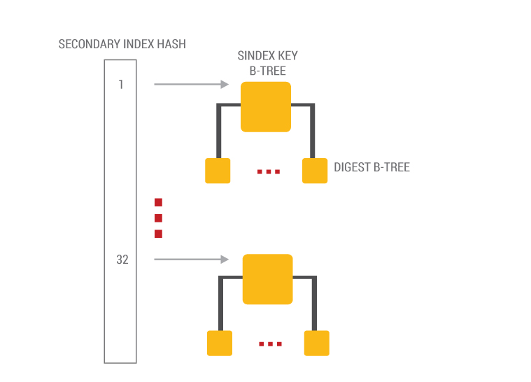

> 표1  
B-트리를 지닌 보조 인덱스

에어로스파이크 기본 인덱스처럼, 보조 인덱스는 B-트리를 가진 해시 테이블의 조합입니다. 보조 인덱스는 구조적으로 B-트리의 해시입니다. 각 논리 보조 인덱스는 32개의 물리적 트리를 가집니다. 인덱스 작업을 위해 키를 구별할때, 해시 기능은 보조 인덱스 항목이 32개의 물리적 트리에서 만들어질 필요가 있는 어떤 물리적 트리를 결정하는데 사용됩니다. B-트리를 식별한후 업데이트는 트리에 만들어집니다, 단일 보조 인덱스 키에 해당하는 많은 주요 레코드 참조가 있다는 점을 주목하세요. 따라서, 이 구조의 최하위 수준은 저장할 필요가 있는 레코드 수에 기반한 B-트리의 모든 목록입니다.

##### 인덱스 관리

###### 인덱스 메타데이터

에어로스파이크는 어떤 인덱스가 특별하게 전세계적으로 유지되는 데이터 구조에 생성되는지에 대한 정보를 유지합니다-시스템 메타데이터(SMD) 시스템. 시스템 메타데이터 모듈은 여러 노드에 여러 보조 인덱스 모듈의 중간에 있습니다. 결국 보조 인덱스에서 만들어진 변화는 항상 SMD에서 트리거됩니다.

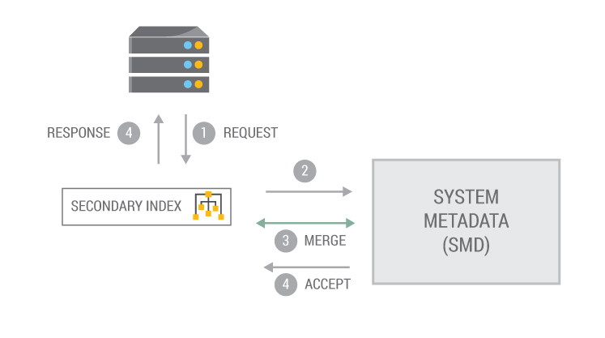

> 표1  
보조 인덱스는 시스템 메타 데이터에서 트리거됩니다.

1. 클라이언트 요청은 보조 인덱스 메타데이터와 관련된 생성/제거/업데이트를 생성합니다. 요청은 SMD에 보조 인덱스 모듈을 거쳐 통과됩니다.
2. SMD는 paxos 마스터애 요청을 보냅니다.
3. Paxos 마스터는 클러스터의 모든 모드에서 적절한 메타데이터 정보를 요청합니다. 모든 데이터를 받을때, 이것을 보조 인덱스 병합 콜백 기능이라고 부릅니다. 이 기능은 위닝 메타데이터 버전을 해결하는 책임이 있습니다.
4. 위닝 버전이 보조 인덱스에 대해 결정할때, 요청은 새로운 메타데이터 정보를 받아들이기 위해 모든 노드에 전송됩니다.
5. 각 노드는 보조 인덱스 생성/제거 DDL 기능을 수행하고나서, 스캔을 트리거하고 클라이언트에 응답합니다.

###### 인덱스 생성

에어로스파이크는 보조 인덱스의 동적 생성을 지원합니다. ==aq1==과 같은 도구는 현재 사용가능한 인덱스를 읽을 수 있고 인덱스의 생성과 파괴를 허용합니다.  

1. 보조 인덱스를 구축하기 위해서, 유저는 네임스페이스,세트,빈 그리고 인덱스의 타입을 지정할 필요가 있습니다(예를들어, 정수,스트링,등등.).
2. **SMD**에서 확인을 받는 경우에(위를 확인), 각 노드는 쓰기-활성 모드에 보조 인덱스를 생성하고 모든 데이터를 스캔하고 보조 인덱스로 항목을 넣는 백그라운드 스캔 작업을 시작합니다.

  * 인덱스 항목은 모든 인덱스 사양과 일치하는 레코드를 위해서만 생성됩니다.
  * 보통 스캔과 달리 인덱스 생성 스캔에 네트워크 구성요소가 없다고 생각하면서, 보조 인덱스가 있는 스캔 작업은 보통의 스캔이 하는 것과 정확히 같은 방법으로 읽기/쓰기 트랜젝션과 상호 작용합니다.(The scan job that populates the secondary index will interact with read/write transactions in exactly the same way a normal scan would, except there is no network component to the index creation scan unlike for the normal scan.) 인덱스 생성 기간동안에, 인덱싱 속성에 영향을 끼치는 모든 새로운 쓰기는 인덱스를 업데이트합니다.

3. 인덱스 생성 스캔이 완성되고 모든 인덱스 항목이 생성되자마자, 인덱스는 바로 쿼리에서 사용할 준비를 하고 읽기-활성으로 표시됩니다.
4. 보조 인덱스는 인덱스가 모든 노드에 성공적으로 생성된 후에 보통의 쿼리를 위해 사용할 수 있습니다.

**추천**  

* 인덱스 DDL(인덱스를 생성/드롭)은 클러스터가 잘 형성되지 않을때나 클러스터가 무결성 오류가 발생할때를 방지해야합니다. 인덱스 구축은 I/O 서브시스템에 모진 작업이라서, 낮은 로드 시간에서 수행되야 합니다.
* 데이터를 지닌 노드가 클러스터에 합류되지만 없어진 인덱스 정의를 가질때, 없어진 인덱스는 생성되고 클러스터가 합류되는 위치에 덧붙여집니다. 인덱스 이동동안에, 쿼리는 이것에 허용되지 않습니다. 이런 상황을 예방하기 위해서, 들어오는 노드의 데이터는 이것이 시작되기 전에 정리해야합니다.

###### 인덱스 우선순위 생성

인덱스 생성 스캔은 이미 트랜젝션에서 커밋된 레코드만을 읽습니다(더티 읽기 아님). 이것은 스캔이 최고 스피드에서 실행되고, 읽기를 막는 레코드의 업데이트가 없다는 걸 의미합니다. 그러므로 인덱스 생성 스캔이 진행중인 읽기와 쓰기 트랜젝션의 지연시간에 불리하게 영향을 끼치지 않는걸 보장하기 위해 적절한 수준에서 인덱스 구축 우선순위를 설정하는 것이 중요합니다. 에어로스파이크 실시간 엔진에서 작업의 우선순위 설정은 효율적으로 인덱스 생성 스캔의 자원 이용을 제어하는데 사용됩니다. 그것들이 데이터의 균형을 재조정하는 것과 낮은 지연시간에 맞서 읽기/쓰기 트랜젝션을 백업하는 것과 같은 장시간 실행하는 작업의 균형을 맞추는 배치 경험에 기반하기 때문에 기본 설정은 대부분의 시간에 충분합니다.

##### 인덱스를 사용해서 데이터 쓰기

데이터가 서버에 기록될때, 현재 인덱스의 시스템 메타데이터(SMD)사양은 체크됩니다. 인덱스를 지닌 모든 빈을 위해서, 보조 인덱스 업데이트/삽입/제거가 수행됩니다. 에어로스파이크가 플렉스-스키마 시스템이라는 걸 주의하세요. 특정 빈을 위한 값이 없거나 빈 갑이 인덱스된 타입이 아닐때, 그 해당하는 보조 작업은 수행되지 않습니다.  

보조 인덱스의 이런 모든 변화는 자동으로 단일 잠금 동기 아래 레코드 변경을 가지고 수행됩니다. 인덱스가 유지되지 않기때문에, 인덱스와 데이터 커밋의 다른 커밋 문제는 속도를 올리면서 제거됩니다.

##### 가비지 컬렉션

데이터가 기본(예를들어, 제거/만기/퇴거/이주)에서 삭제될때 데이터는 보조 인덱스의 항목을 제거하기 위해서 디스크에서 읽지 않습니다. 이것은 I/O 서브시스템에 필요없는 짐을 놓는 걸 방지합니다. 보조 인덱스에 왼쪽 항목은 정기적으로 일어나고 클린업을 수행하는 백그라운드 스레드에 의해 제거됩니다. 가비지 컬렉터는 복잡하지 않게 설계됩니다. 이것은 작은 배치에서 제거될 항목의 목록을 생성하고나서 천천히 인덱스에서 그들을 제거합니다. 이것은 만기와 퇴거의 최대량을 가지는 시스템에, 가비지 컬렉션을 수용하기 위해 보조 인덱스에 대한 메모리의 공급 이상을 요구합니다.

##### 분산된 쿼리

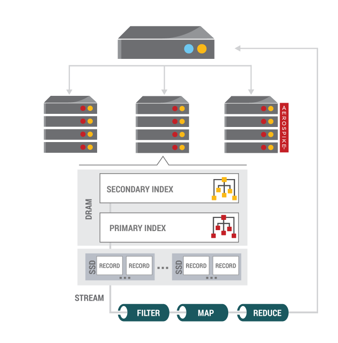

보조 인덱스에서 결과를 회수하는 쿼리는 모든 클러스터 노드에 전송됩니다. 기본 구조는 다음 페이지에 있는 표 B에서 설명되고 그 단계는 다음과 같습니다:

1. 모든 노드에 "흩뿌리다" 요청
2. 기본 키에 빠른 2차 매핑을 위한 RAM의 인덱스
3. ACID를 관리하고 이주를 관리하기 위해 SSDs에 데이터를 지닌 각 노드와 동일한 위치를 가지는 인덱스
4. 모든 SSDs/DRAM에서 병렬로 레코드 읽기
5. 각 노드에 결과를 전파
6. 클라이언트에 모든 노드에서 결과를 "모으다"

보조 인덱스 검색은 기본 키 레코드의 아주 긴 목록을 평가할 수 있습니다. 이런 이유로, 우리는 작은 배치에서 보조 인덱스 검색을 하기 위해 선택합니다. 또한 메모리 한계점에 도달했을때, 응답은 바로 네트워크에 플러시되도록 클라이언트의 응답에 일부 배치가 있습니다. 이것은 에어로스파이크 배치 요청의 반환 값과 비슷하게 행동합니다. 일반적인 아이디어는 쿼리의 선택성에 관계없이 개별 보조 검색의 메모리 사용을 일정한 크기로 유지하는 것입니다.

##### 쿼리 결과

쿼리 프로세스는 결과가 쿼리가 실행되고 레코드가 스캔되는 시간에 실제 데이터를 가지는 동기에 있는 걸 보장합니다. 쿼리 프로세스가 커밋되지 않는 동안에 그 어디에도 데이터 읽기가 쿼리의 부분으로 발생하지 않습니다. 그러나, 쿼리는 삭제된 데이터를 스스로 반환할 수 있습니다.

###### 클러스터 상태 변화의 존재

다음 테이블은 재구성된 보조 인덱스와 쿼리 결과의 일관성 시나리오를 설명합니다.

시나리오 | 영구적인 네임스페이스 부트 타입 | 데이터-인-메모리 | 보조 인덱스 생성 | 노드 부트 시간 | 이동하는동안 쿼리의 일관성
-------|------------------------------|--------------|-----------------|--------------|----------------------
노드가 합류 | 빠른 재시작없이 데이터를 가지는; | 거짓 | 디스크에서 데이터 로드를 게시; 병렬 데이터 파티션 스캔 | 보조 인덱스가 없는 것보다 더 높은 데이터 로드 시간 | 최선*
노드가 합류 | 빠른 재시작을 지닌 데이터를 가지는;(공유된 메모리에 기본 키 인덱스 사용가능한) | 거짓 | 빠른 재시작 게시; 병렬 데이터 파티션 스캔** | 보조 인덱스가 없는 것보다 더 높은 데이터 로드 시간 | 최선*
노드가 합류 | 빠른 재시작 없이 데이터를 가지는; | 참 | 디스크의 데이터로드에 | 보조 인덱스 유무의 큰 차이 없음 | 최선*
노드가 합류 | 항상 빠른 재시작없이 데이터를 가지지 않는; | 참/거짓 | -NA- | -NA- | 일관된 복사
노드가 떠남 | -NA- | 참/거짓 | -NA- | -NA- | 일관된 복사

> **최선**은 업무적으로 반드시 최신이 아닌 일관된 데이터의 복사입니다(중복 레코드 복사의 존재에서,합병은 보조 인덱스 쿼리에서 결과가 반환되기 전에 수행되지**않습니다**). 모든 이주가 완료된 후에 이것은 항상 최신의 일관성된 복사입니다.  
> **빠른 재시작**은 보조 인덱스를 위해 지원되지 않습니다.

정상 작동 환경 아래, 노드는 클러스터에서 완전한 쿼리 가용성을 가지고 단순히 추가되고 제거될 수 있습니다. 데이터가 디스크에서 로드될때 그리고 이주가 일어날때 에어로스파이크는 데이터 로딩을 다룹니다(결과 일관성을 위해 테이블을 참조).

##### 쿼리 노드

데이터 이동동안 정확환 쿼리 결과를 얻는 것은 복잡합니다. 노드가 클러스터에서 추가되거나 제거될때, 데이터 이동 모듈은 노드의 트랜젝션을 위해 데이터를 언급합니다(When a node is added or removed from the cluster, the Data Migation Module is invoked to transition the data to and from nodes as appropriate for the new configuration). 이런 이주 활동 동안에, 파티션은 많은 노드의 다른 버전에서 사용할 수 있습니다. 요구된 데이터를 가지는 파티션의 위치를 찾는 쿼리를 위해, 에어로스파이크 쿼리 처리는 클러스터의 노드간에 공유되는 추가의 파티션 상태를 이용하고, 쿼리가 실행되고 있는 각 파티션을 위해 **쿼리 노드**의 신중한 선택을 만듭니다. 주어진 파티션에 대한 쿼리 노드는 다양한 요소에 기반해서 선택됩니다(예를들어, 파티션의 레코드 수,클러스터에 존재하는 파티션의 복제수,등등). 여기서의 목표는 가장 정확한 쿼리의 결과를 얻는 것이고 시스템은 그것을 하기위해 설계됩니다.

##### 전파

쿼리 레코드는 필터,전파,등등을 수행하기 위해 전파 프레임워크로 제공할 수 있습니다. 각 노드에서, 쿼리 결과는 레코드의 스트림으로 결과의 처리를 시작하기 위해 UDF 서브 시스템에 전송됩니다. 유저에 의해 언급된 스트림 UDF는 적용되고 유저에 의해 정의된 작업의 순서는 쿼리 결과에 적용됩니다. 각 노드의 결과는 데이터에 추가 작업을 수행하는 클라이언트 어플리케이션에 의해 수집됩니다.

###### 성능

전파가 전반적인 데이터베이스 성능에 영향을 주지 않는걸 보장하기 위해서, 우리는 다양한 기술을 사용:  

글로벌 큐는 다양한 처리 단계를 통해 공급되는 레코드를 관리하기 위해 사용되고 스레드 풀은 효과적으로 CPU 병렬화를 이용하기 위해 사용됩니다. 시스템이 적절히 스트림 UDF 파이프라인을 관리하도록 쿼리 상태는 전체 스레드 풀 사이에 공유됩니다. 초기 데이터 페치 부분을 제외하고 전파의 모든 단계는 CPU 바운드 작업이라는 걸 주의하세요. 그래서 여러 단계의 처리를 빠르고 최적으로 종료하는 것이 중요합니다. 이것을 가능하게 하기 위해서, 우리는 실시간 레코드를 처리하는 최대량의 시스템 오버헤드를 최적화하기 위해 레코드의 배칭,UDF 상태의 캐싱,기타등등과 같은 기술을 사용합니다.  

게다가, 인메모리에 저장된 데이터를 지닌 네임스페이스에서의 작업을 위해서(저장소 페치 없음), 스트림 처리는 단일 스레드 맥락에서 구현됩니다- 심지어 에어로스파이크가 기본적으로 데이터를 고정된 파티션 수로 나뉘기 때문에 시스템은 여전히 데이터 파티션에서의 작업을 병렬화할 수 있는 이런 경우에도

#### 하이브리드 저장소

하이브리드 메모리 시스템은 각 노드에 저장된 인덱스와 데이터를 보유하고, 물리적 저장소와의 상호작용을 다룹니다. 이것은 또한 자동으로 데이터베이스에서 오래된 데이터를 제거하고 디스크 사용량을 최적화하기위해 물리적 저장소를 디프래그하는 모듈을 포함합니다.  

에어로스파이크는 데이터를 DRAM, 기존 회전 미디어,그리고 SSDs에 저장할 수 있고 각 네임스페이스는 따로따로 설정될 수 있습니다. 이 구성의 유연성은 자주 DRAM에 접근하는 작은 네임스페이스를 넣기위해 어플리케이션 개발자를 허용합니다,하지만 SSD와 같이 더 저렴한 저장소에는 더 큰 네임스페이스를 배치합니다.  

중요한 작업은 저수준의 SSD 읽기 및 쓰기 패턴을 이용하는 파일 시스템을 바이패싱하는 걸 포함하는 SSDs의 데이터 저장소를 최적화하기 위해 실시됩니다.

##### 철학

[큰 데이터 형식](http://www.aerospike.com/docs/architecture/ldt.html)외에,레코드에 대한 모든 데이터는 같이 저장되어 있습니다. 각 열에 대한 저장소의 양은 기본적으로 1MB 크기로 제한됩니다.  

저장소는 최적화 프로세스에 의해 재요구되는 자유 공간을 가진 copy-on-write 입니다.  

각 ==네임스페이스==는 저장소의 고정된 양으로 설정됩니다. 각 노드는 각 서버에 동일한 네임스페이스와 각 네임스페이스를 위한 동일한 저장소의 양을 가집니다.  

저장소는 순수한 지속성이없는 DRAM,저장소 지속성을 지닌 DRAM,또는 플래시 저장소(SSDs)를 사용하여 구성될 수 있습니다.  

영구적인 저장소(디스크)는 플래시 또는 다른 고성능 블록 저장소 장치(클라우드)중 하나이거나 또는 저장 장치에 파일일 수 도 있습니다.  

##### DRAM의 데이터

지속성없이 순수하게 DRAM의 데이터는 더 높은 처리량의 이익을 가집니다. 현대의 플래시 저장소가 매우 높은 성능이더라도, DRAM은 더 높은 성능이고, DRAM의 조각은 하락하고 있습니다.  

데이터는 ==JEMalloc== 할당자를 통해 할당됩니다. ==JEMalloc==은 다른 풀로 할당을 허용합니다. 저장소 계층에 대한 것과 같은 긴 시간 할당은 따로따로 할당될 수 있습니다. 우리는 ==JEMalloc==할당자가 낮은 조각화에 관하여 우수한 속성을 가지는 걸 발견합니다.  

DRAM의 여러 복사본을 사용함으로써, 매우 높은 수준의 신뢰성을 얻을 수 있습니다. 에어로스파이크가 자동으로 다시 조각나고 데이터를 실패 또는 클러스터 노드 추가에 복제하기 때문에 높은 수준의 "k-안전"을 얻을 수 있습니다. 온라인에서 노드를 가져오는 것은 자동으로 복사본 중 하나에서 이것의 데이터를 생성합니다.  

에어로스파이크의 랜덤 [데이터 분산](http://www.aerospike.com/docs/architecture/data-distribution.html)때문에, 일부 노드가 손실될때 데이터 비가용성은 매우 작을 수 있습니다. 예를들어, 데이터의 두 개 복사본을 가지는 10개의 클러스터 노드에서, 두 노드가 빨리 손실될때, 복제가 약 2%가 되기전에 데이터 비가용성의 양은 데이터의 1/50입니다.  

지속성 계층이 설정될때, 읽기는 항상 DRAM 복사에서 발생합니다. 쓰기는 아래에서 묘사된 데이터 경로를 통해 발생합니다.  

##### SSD/플래시의 데이터

데이터가 작성될때, 쓰기 래치는 열마다 동일한 레코드에서 충돌하는 두 쓰기를 피하기 위해 사용합니다. 어떤 클러스터 상태에서, 데이터는 다른 노드와 해결된 충돌에서 읽을 필요가 있습니다.  

쓰기가 입증된 후에, 레코드의 인메모리 표현은 마스터에 업데이트됩니다. 작성된 데이터는 쓰기 버퍼에 추가됩니다. 쓰기 버퍼가 꽉 찰때, 이것은 디스크에 대기하고 있습니다. 최대 열 크기와 쓰기의 처리량과 동일한 쓰기버퍼의 크기에 따라, 커밋되지 않은 데이터의 일부 위험이 있습니다.  

복제가 있을때, 그들은 업데이트되고 또한 그들의 인메모리 인덱스들도 업데이트됩니다. 데이터가 모든 인메모리 복사에 업데이트된 후에, 결가는 클라이언트에 반환됩니다.  

시스템은 모든 쓰기 지연된 일관성 전에 클라이언트에 결과를 반환하도록 설정될 수 있습니다.

##### 데이터 저장

에어로스파이크의 데이터는 정수,스트링,블롭(blob),선천적으로 직렬화된 타입,목록,맵,그리고 [LDTs](http://www.aerospike.com/docs/architecture/ldt.html)를 포함합니다.  

조금 더 효율적인 "단일 빈 모드"외에, 에어로스파이크의 열인 빈은 각각 스트링 테이블을 사용하여 저장되는 빈 이름을 가집니다. 행의 이름은 한 번 저장되지만, 네임스페이스에서 사용되는 고유한 빈 이름은 오직 32K개가 있습니다.  

더 많은 빈 이름이 필요하면, 맵을 사용하는 걸 고려해보세요. 맵에서, 너는 키-값 쌍의 임의의 세트를 저장할 수 있고, 효율성을 위해 UDF의 그 값에 접근할 수 있습니다.  

너가 자바에서 너의 클래스처럼 복잡한 언어 타입을 데이터 콜에 전달할때, 에어로스파이크 클라이언트는 언어의 고유 직렬화 시스템을 사용할 수 있습니다. 그 데이터는 특정 언에어서 "블롭 타입"으로 저장됩니다. 이것은 클린 코드를 지닌 데이터를 읽는 같은 언어의 클라이언트를 허용하지만, 대부분 언어의 기본 직렬자는 안 좋습니다.  

정수는 현재 버전에서 정수 값을 제한하는 8 바이트 양으로 저장됩니다. 에어로스파이크 네트워크 프로토콜은 다양한 크기의 정수를 허용하고 확장을 가능하게 합니다.  

스트링은 UTF-8로 저장됩니다. UTF-8은 유니코드보다 많은 스트링에 대해 더 컴팩트합니다. 크로스 언어 호환성을 허용하기 위해서, 클라이언트 라이브러리는 기존 문자 세트에서 유니코드를 UTF-8,과 백으로 전환합니다.(In order to allow cross-language compatibility,client libraries convert from the native character set unicode,to UTF-8,and back)  

최대 효율은 바이너리 객체(블롭)으로 사용할 수 있습니다. 이들은 오직 레코드 크기에 의해서만 크기가 제한됩니다. 많은 배치는 자신의 직렬 변화기를 사용하고 아마 그 객체를 압축하고 그 객체를 바로 저장합니다. 이렇게하면 데이터가 쉽게 UDF를 통해 접근할 수 없음을 의미합니다.  

복잡한 타입은 로컬 저장소를 위해 ==msgpack==으로 제공됩니다. 복잡한 객체는 클라이언트에 직렬화되고, 무선의 프로토콜을 사용해서 전송됩니다. 단순한 겟 및 풋 작업을 사용할때, 네트워크 포맷은 직렬화 또는 전환 없이 저장소에 바로 작성됩니다.

##### 플래시 최적화

조각모음은 디스크에 각 블록의 활성 레코드 수를 추적하고 사용의 최소 수준보다 떨어지는 블록을 재사용합니다. 조각모음 시스템은 지속적으로 사용가능한 블록을 스캔하고 일정 양 이상의 블록을 바랍니다.

##### 저장소에 가반한 퇴거

조각모음은 디스크에 각 블록의 활성 레코드 수를 추적하고 사용의 최소 수준보다 떨어지는 블록을 재사용합니다. 에빅터는 만기된 레코드에 참조를 제거하고 시스템이 세트 하이 워터 마크이상으로 얻을때 메모리를 재사용하는 것에 대해 책임이 있습니다. 네임스페이스를 설정할때, 관리자는 네임스페이스의 데이터를 위한 기본 수명뿐만 아니라 그 네임스페이스를 위해 사용되는 DRAM의 최대량을 지정합니다. 일반 작업아래, 에빅터는 메모리의 인덱스를 해제하고 디스크에 레코드를 풀어주면서 만기된 데이터를 찾습니다. 메모리가 설정된 하이 워터 마크를 초과할때 만기된 레코드가 필요없더라도, 에빅터는 또한 네임스페이스에서 사용되는 메모리를 추적하고 더 오래된 것을 방출합니다. 시스템이 그것의 메모리 제한을 칠때 에빅터가 이전 데이터를 제거하도록 함으로써 에어로스파이크는 효과적으로 LRU 캐쉬로 사용될 수 있습니다. 레코드의 시대는 이것이 수정된 마지막 시간에서 측정되고 어플리케이션은 레코드에 데이터를 쓰는 기본 수명시간에 언제든지 오버라이드 할 수 있습니다. 어플리케이션은 또한 특정 레코드가 절대 자동으로 퇴거되지 않는 시스템을 말합니다.

##### 큰 레코드

큰 레코드는 다른 방법으로 저장되지만, 단일 레코드 제한 이상으로 가는 데이터를 허용합니다. [큰 데이터 타입 구조](http://www.aerospike.com/docs/architecture/ldt.html)를 참조하세요.

#### 큰 데이터 타입

큰 데이터 타입(LDTs)는 제한이 사용가능한 저장소에 기반하고 레코드의 최대량에 기반하지 않는 데이터의 매우 큰 양을 포함하기 위해 개별 기록을 허용합니다.  

에어로스파이크 LDT 기능은 우리가 "서브-레코드"로 언급하는 에어로스파이크 유저 정의 함수 메커니즘과 새로운 저장소 타입을 이용합니다. 서브-레코드는 그들이 부모 레코드와 연결된 주요 예외를 뺀 정규 에어로스파이크 기록과 매우 비슷합니다. 그들은 부모 레코드와 동일한 파티션 주소와 내부 기록 잠금을 공유해서, 그들은 이동하는 동안에 그들의 부모 레코드를 가지고 이동하고 그들은 부모 레코드와 같은 분리 메커니즘 아래에 보호됩니다.  

에어로스파이크 큰 객체는 연관된 레코드와 인접하여 저장되지 않지만, 대신에 표 1에서 보이는 것처럼 서브 레코드(약 2Kb 에서 32Kb 범위의 크기를 가진)로 분할딥니다. 서브 레코드는 같이 인덱스되고 링크되고 유저 정의 함수(UDFs)를 통해 인-데이터베이스를 관리합니다.

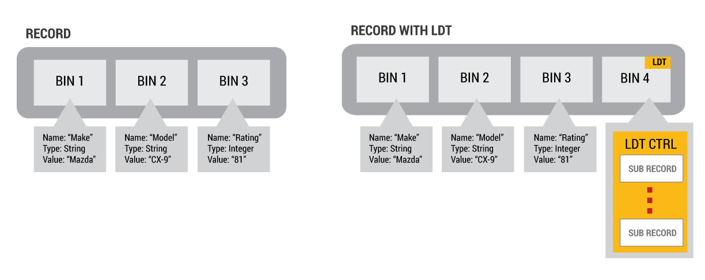

> 표1  
큰 데이터 타입이 있거나 없는 레코드

표1은 에어로스파이크 데이터베이스 레코드의 두가지 예를 보여줍니다. 왼쪽은 3개의 빈을 가지는 보통의 레코드입니다. 오른쪽은 LDT 빈에서 증가한 것과 같은 레코드입니다. 에어로스파이크는 큰 스택(lstack), 큰 세트(lset), 큰 리스트(llist) 그리고 큰 맵(lmap) 같이 몇개의 큰 데이터 타입을 정의하기 위해 UDFs를 사용합니다.  

아래에서 설명되듯이,서브 레코드 관리의 모양과 스타일은 특정 LDT 컬렉션 타입에 의존합니다.  

에어로스파이크는 몇개의 큰 데이터 타입을 정의하기 위해서 사용: 큰 스택(lstack), 큰 세트(lset), 큰 리스트(llist) 그리고 큰 맵(lmap). 이런 객체는 클라이언트 사이드 APIs를 사용하여 서버에 인-데이터베이스를 처리합니다.  

특정 LDT 작업(예를들어, 100바이트 삽입)의 비용만 지불하고 전체 LDT를 업데이트하는 비용(예를들어, 100 메가바이트)과 클라이언트와 서버사이의 전체 LDT를 이동하는 비용은 지불하지 않는 동안 LDTs는 매우 큰 데이터의 컬렉션을 관리하기 위해서 새로운 레코드 빈 타입과 새로운 서브-레코드 저장소 컨테이너 타입을 이용합니다.  

새로운 LDT 특징은 새로운 특별한 빈 타입과 새로운 저장소 컨테이너에 의해 가능하게 됩니다. 새로운 특별한 빈 타입은 직접적인 방법으로 접근할 수 없는 "LDT 빈" 이지만, 대신에 시스템 LDT 기능에서만 접근할 수 있습니다. LDT 빈은 LDT 인스턴스의 설정과 레이아웃을 정의하는 복잡한 제어 구조(==ldtCtrl==라는)를 포함합니다([LDT 내부](http://www.aerospike.com/docs/guide/ldt_internals.html)섹션은 복잡한 ==ldtCtrl== 구조를 포함합니다.). 파일 시스템 인덱스 노드(inode)가 파일에 대한 저장소 블록을 설명하는 복잡한 객체로 구성된 유닉스-스타일 파일 시스템 같이, 에어로스파이크 LDT 구조는 LDT 컬렉션에 대한 설정과 저장소 컨테이너를 설명합니다.  

LDT 제어 구조는 LDT 컬렉션 경우에서 사용되는 설정과 저장소 컨테이너를 설명합니다. 저장소 컨테이너는 "서브-레코드"라고 불리는,레코드의 새로운 타입입니다. 서브-레코드는 그들이 부모 레코드에 연결되는 주요 예외로 보통의 에어로스파이크 레코드와 매우 비슷합니다. 서브-레코드는 내부 레코드 잠금과 같은 다른 자원뿐만 아니라 그들의 부모와 동일한 파티션 주소를 공유합니다. 그들이 잠금을 공유하기 때문에, 그들은  부모 레코드와 같은 분리 메커니즘아래 보호됩니다. 서브 레코드는 이동하는 동안에 부모 레코드를 가지고 이동합니다. 따라서, LDT 객체는 균형을 재조정하는 에어로스파이크의 튼튼한 복제와 고가용성과 즉각적인 일간성을 보장하는 이동 메커니즘을 이용합니다. LDT 객체는 클라이언트 사이드 APIs를 사용하여 서버에 인데이터베이스를 처리합니다.  

표1에서 보여주는 것과 같이, 에어로스파이크 LDT 객체는 여러 서브레코드로 구성됩니다(대략 2kb 에서 1mb 범위의 크기를 지닌). 서브 레코드는 같이 인덱스되고 링크되고 [유저 정의 함수](http://www.aerospike.com/docs/architecture/udf.html)(UDFs)를 통해 인-데이터베이스를 관리합니다. 서브레코드의 사용은 LDT 인스턴스에 대한 접근이 전형적으로 전체 레코드 빈 값보다 단일 서브 레코드에 영향을 끼치는 걸 의미합니다.

##### 서브레코드

서브레코드는 부모 레코드에 연결되는 레코드입니다. 부모 레코드는 어플리케이션이 저장하고 회수하기 위해 데이터와 상호 작용하는 일반 레코드입니다. 일반 레코드와 달리, 서브레코드는 바로 접근할 수 없습니다. 대신에, 서브레코드는 일반 (부모) 레코드를 통해서만 접근될 수 있습니다.  

부모 레코드와 서브 레코드를 사용하여, 링크된 데이터 구조는 데이터의 큰 양을 저장하기 위해 생성됩니다. 이것을 트리로 보면, 부모 레코드는 트리의 뿌리 노드이고 각 서브레코드는 트리의 브랜치나 나뭇잎 노드입니다. 아무 브랜치나 나무잎에 접근하기 위해서, 너는 루트에서 시작해야 합니다.  

서브레코드가 부모 레코드와 인접하게 저장되있지 않더라도, 부모 레코드와 같이 복제되고 이동하기 위해 서브레코드를 허용함으로써 그들은 부모 레코드와 동일한 파티션에 저장됩니다.

##### 큰 스택

**큰 스택 객체(lstack)**는 "나중에 들어간게 먼저 나오는(LIFO)"와 비슷한 노드를 따릅니다. 이것은 스택에 푸시된 대부분의 최신 아이템이 스택에서 팝되거나 피크되는 첫번째 아이템이라는 걸 의미합니다. 엄격한 시간에 기반한 것이 아닐지라도, 스택의 아이템 삽입 순서는 전형적으로 아이템이 생성되거나 발견되는 순서를 나타냅니다.(표 2a)

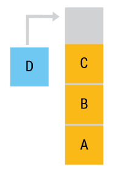

> 표 2a  
큰 스택 작동

클라이언트 사이드 LStack 기능에서 지시된 호출이더라도, 작업은 데이터베이스 서버에서 실행됩니다. 데이터의 큰 양은 이것이 클라이언트에 반환되기 전에 서버에 페치되고 필터될 수 있습니다.  

큰 스택 데이터 저장소는 계층으로 구성되어 있습니다. 최상의 성능을 실현하기 위해서, 스택의 최상위에 접근하는 것이 가장 빠릅니다. "웜 데이터"는 하나의 I/O 간접 방식입니다. "콜드 데이터"는 두개의 I/O 간접 방식입니다.(표 2c)

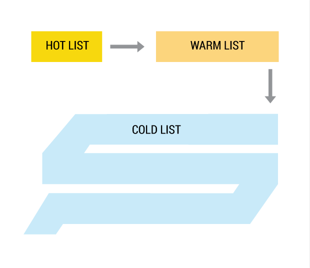

> 표 2c  
핫,중간 그리고 콜드 데이터를 지닌 큰 스택

물리적으로, lstack 구조는 다음과 같이 구성되어 있습니다(표 2d). LSTACK LDT 제어 구조는 설정 데이터,"핫 리스트" 데이터 항목, "웜 리스트" 서브 레코드 포인터와 "콜드 리스트" 디렉토리 체인 포인터를 보유합니다.  

"핫 리스트" 데이터는 부모 레코드에 바로 저장되기 때문에, 핫 리스트 데이터에 바로 접근합니다; 읽기 또는 쓰기에 관여하는 추기의 I/O가 없습니다. 크기는 유저의 필요에 맞게 설정할 수 있지만, 기본적으로 핫 리스트 크기는 100개의 객체입니다.  

부모 레코드는 또한 서브레코드 포인터의 목록인 "웜 리스트"를 포함합니다. 기본적으로 웜 리스트 크기는 100이고, 10000 객체의 웜 리스트 기본 용량을 제공하는 서브레코드 수용력도 100입니다. 핫 리스트와 마찬가지로, 이러한 모든 매개변수는 최적의 조화를 위해 관라자에 의해서 설정될 수 있습니다.

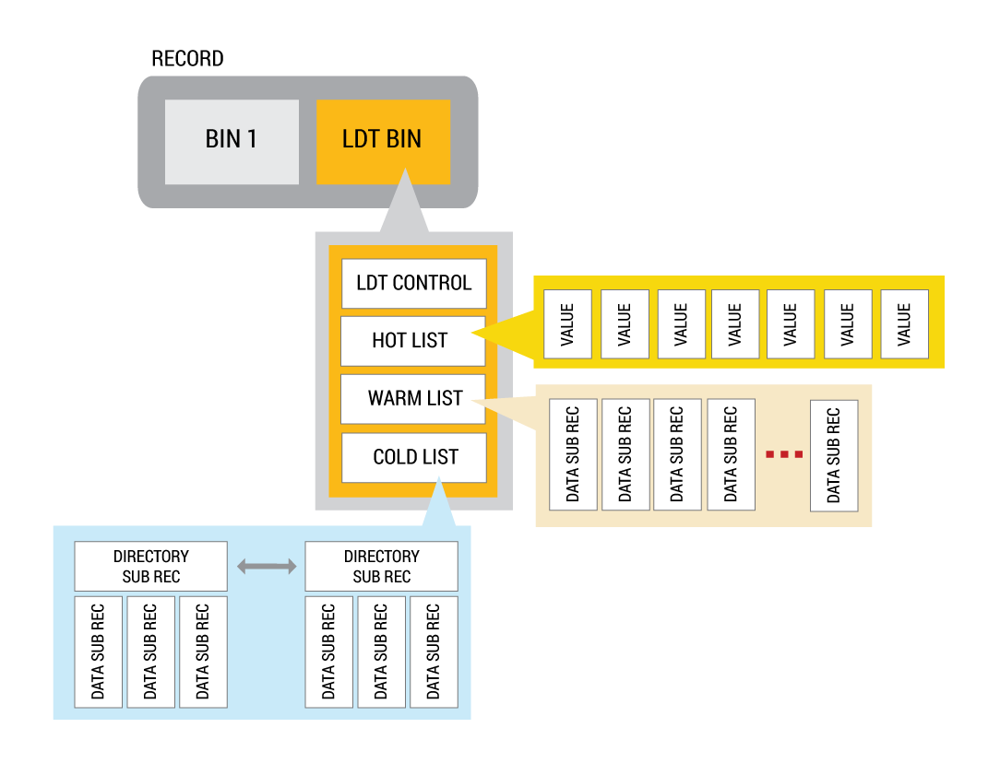

> 표 2d  
큰 스택 물리적 레이아웃

마지막으로, 부모 레코드는 각 디렉토리가 데이터 서브레코드의 포인터를 포함하는 디렉토리를 포함하는 서브레코드의 목록에 링크된 콜드 데이터 디렉토리에 포인터를 포함합니다. 각 콜드 리스트 디렉토리 노드는 기본적으로 웜 리스트와 동등합니다. 스택 객체는 자연스럽게 핫 리스트에서 웜 리스트로 이동하고 시간이 지나선 콜드 리스트로 이동합니다. 이 계층 조직은 핫 리스트에 접근이 추가의 I/O 발생이 없고, 웜 리스트에 접근이 오직 하나의 추가 I/O가 발생하고 콜드 리스트에 접근이 두개이상의 I/Os가 발생하는 걸 보장합니다.  

콜드 리스트의 크기가 바운드하지 않기 때문에, 큰 스택 인스턴스는 어떤 크기의 제한이 없습니다. 또한, 데이터가 자연스럽게 핫에서 웜이나 콜드로 이동하기 때문에, 큰 스택의 크기는 일정한 크기에 캡할 수 있습니다. 캡 이상으로 이동하는 데이터는 함축적으로 버려지고 서브레코드는 재사용됩니다.  

lstack의 컨텐츠는 핫,웜,콜드인 계층에 저장됩니다. "핫" 계층은 가장 최근에 작성된 데이터 아이템입니다. "핫" 계층이 가득찰때, 더 오래된 아이템은 "웜" 계층으로 푸시될 것입니다. "웜" 계층이 가득찰때, 더 오래된 아이템은 "콜드" 계층으로 푸시될 것입니다.

##### 큰 세트

**큰 세트 객체(lset)**는 고유한 객체의 컬렉션입니다(표 3a). 객체는 원자(예를들어, 숫자,스트링) 또는 복합체(예를들어, 맵,리스트)로 할 수 있습니다. lset는 요소가 존재하는지 여부를 결정하는 빠르고 효과적인 검색을 위해 인덱스를 유지합니다.

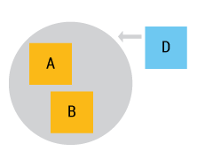

> 표 3a  
큰 세트 작업

LSET LDT 제어 구조는 큰 맵 특유의 구성 설정과 큰 맵 해시 테이블을 포함합니다. 해시 테이블은 세트의 크기가 자라는 선형 해싱 알고리즘을 사용합니다.

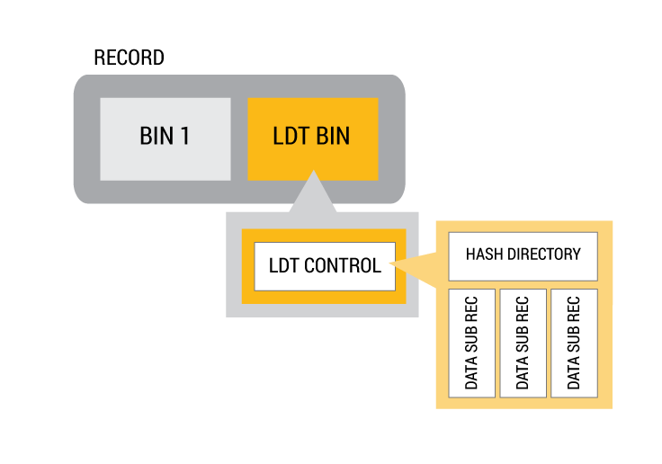

> 표 3b  
큰 세트 물리적 레이아웃

해시 테이블은 각 셀 상태가 다음 중 하나를 보여주는 셀을 포함합니다:

* 빈
* 짧은 리스트
* 단일 서브레코드
* 여러 서브레코드의 뿌리 트리

큰 세트의 최대 크기가 최고 레코드의 LDT 빈에 있는 해시 테이블의 크기에 의존하기 때문에, 큰 세트는 함축적으로 2기가바이트보다 크지않은 사이즈에 바운드하고 다른 큰 값이 레코드에 있으면 아마 그것보다 더 적게 바운드합니다.  

큰 세트 값은 내부 해시 테이블에 저장됩니다. 해시는 전체 객체(이것이 숫자나 스트링 같은 원자 타입일때)나 객체가 복합체일때(예를들어, 리스트 또는 맵) "스트링필드" 객체에서 계산됩니다; 또는 사용자가 적절한 "unique_identifier()" 기능을 지원할때 해시는 복합 객체의 서브세트에서 계산됩니다.

##### 대규모 정렬된 리스트

**대규모 정렬된 리스트 인스턴스(llist)**는 큰 규모에 분류된 목록을 관리합니다. 복합 객체에서 원자 값, 검색 키을 얻기 위해 사용가능한 방법이 있다는 조건하에 정렬된 목록의 객체는 원자(예를들어 숫자,스트링) 또는 복합체(예를들어 맵,리스트)가 될 수 있습니다(표 5a).

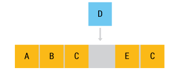

> 표 5a  
대규모 정렬된 리스트 작업

물리적으로, 대규모 리스트 구조는 다음과 같이 구성됩니다(표 5b). 대규모 리스트는 내부 트리 노드와 나뭇잎이 서브레코드인 B+트리에 구현됩니다. B+ 트리의 루트는 부모 레코드에 있습니다.

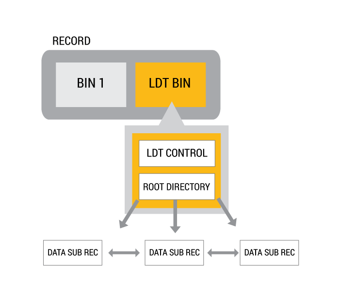

> 표 5b  
대규모 정렬된 리스트 물리적 레이아웃

B+ 트리 구조의 깊이에는 제한이 없습니다, 따라서 대규모 정렬된 리스트 인스턴스의 크기에도 제한이 없습니다.  

LLIST LDT 제어 구조는 대규모 리스트 LDT와 관련된 모든 정보를 포함합니다. 이것은 다음과 같은 정보를 포함:

* 사용자 모듈가 변형/비변형/필터/키 기능
* 키 타입
* 저장소 구성과 제한
* 루트,노드와 나뭇잎 카운트
* 저장소 상태와 기준치
* 루트 값과 노드 포이터 배열(B+ 트리 루트 노드)

##### 대규모 맵

**대규모 맵 객체(lmap)**는 대규모 규모를 제외하고 맵의 기본 이름/값/속성을 구현합니다(표 4a).

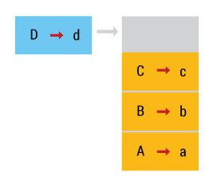

> 표 4a  
대규모 맵 작업

대규모 맵은 원자 이름 값(숫자,스트링)과 문서 또는 객체 값이 있는 사전 저장에 적합합니다.  

대규모 세트와 마찬가지로 LMAP LDT 제어 구조는 대규모 맵 고유의 구성 설정과 대규모 맵 해시 테이블을 포함합니다. 해시 테이블은 해시테이블이 세트의 크기로 커지는 선형 해싱 알고리즘을 사용합니다(표 4b).  

해시 테이블은 각 셀 상태가 다음 중 하나를 보여주는 셀을 포함합니다:

* 빈
* 짧은 리스트
* 단일 서브레코드
* 여러 서브레코드의 라디스 트리

> 표 4b  
대규모 맵 물리적 뷰

대규모 맵의 최대 크기가 최고 레코드의 LDT 빈에 있는 해시 테이블의 크기에 의존하기 때문에, 대규모 맵은 함축적으로 2 기가바이트보다 크기 않은 사이즈에 바운드하고, 다른 큰 값이 레코드에 있을때 아마 그것보다 더 적게 바운드합니다.

##### 유용한 링크

* [LDT 특징 가이드](http://www.aerospike.com/docs/guide/ldt.html)
* [LDT 내부](http://www.aerospike.com/docs/guide/ldt_internals.html)

### 분산

에어로스파이크 데이터베이스는 항상 사용가능하고 신뢰성을 가지는 큰 데이터를 다루는 어플리케이션을 위해 기어합니다. 이것은 여러가지 영향이 있습니다:

* 너의 어플리케이션을 개발할때, 너는 데이터가 어디에 위치되는지에 대해 걱정할 필요가 없습니다. 클라이언트는 데이터 위치를 자동으로 감지하고 요청의 대다수가 단일 홉에 처리되는 걸 보장하고 에어로스파이크의 스마트 클라이언트는 클러스터 분산 문제를 처리합니다.
* 너가 용량을 추가하고 싶을때, 너는 단순히 클러스터에 노드를 추가하고 클러스터는 새로운 노드를 포함하기 위해 재조정합니다. 너가 용량을 추가할때 처리량과 성능 규모는 선형적으로 확장합니다.
* 실패의 한 포인트가 없습니다. 노드가 실패하거나 유지 또는 업그레이드를 위해 오프라인을 취할때 노드의 SSD는 실패할 수 있습니다.
* 전체 데이터 센터는 신뢰성에 영향을 주지 않고 실패할 수 있습니다.

확실하게 클러스터를 관리하는 것은 에어로스파이크 데이터베이스의 코어라서, 우리는 매우 중요하게 그 작업을 취해야 합니다. 에어로스파이크는 이것을 아래 나와있는 것에 의해서 실현합니다:

* [데이터 분산](http://www.aerospike.com/docs/architecture/data-distribution.html) : 에어로스파이크는 핫 스팟과 아무 수동 간섭없이 자동으로 재조정하는 데이터를 피하기 위해 데이터가 균일하게 분산되는 걸 확실히 하고 강력한 파티셔닝을 가집니다.
* [클러스터링](http://www.aerospike.com/docs/architecture/clustering.html) : 에어로스파이크는 자동으로 실패와 치유를 감지하는 능력을 가지는 클러스터된 데이터베이스입니다.
* **복제** : 에어로스파이크는 실패의 한 포인트를 피하기 위해 다음과 같은 복제 능력을 제공합니다.

   1. **인트라 클러스터 복제**
   2. [랙 인식 복제](http://www.aerospike.com/docs/architecture/rack-aware.html)
   3. [크로스 데이터 센터 복제](http://www.aerospike.com/docs/architecture/xdr.html)

#### 데이터 분산

에어로스파이크 데이터베이스는 **아무것도 공유되지 않은** 구조를 가집니다: 에어로스파이크 클러스터의 모든 노드는 동일하고,모든 노드가 동료이고 실패의 단일 포인트가 없습니다.  

데이터는 에어로스파이크 스마트 파티션^tm^ 알고리즘을 사용하여 클러스터의 노드에 고르게 분배됩니다. 우리는 필드에 우리의 방법을 테스트해보고 이 랜덤 해시 기능은 파티션이 1-2% 에러 허용범위내에서 매우 고르게 분산되는 걸 보장합니다.  

레코드가 가는 곳을 결정하기 위해서, 레코드 키(아무 크기의)는 RIPEMD 160을 사용하여 20바이트로 고정된 길이 스트링에 해시됩니다. 그리고 첫번째 12비트는 어떤 파티션이 이 레코드를 포함할지 결정하는 파티션 아이디를 형성합니다. 파티션이 클러스터 노드 사이에서 균등하게 분산됩니다, 그래서 만약에 클러스터에 N개의 노드가 있으면, 각 노드는 약 데이터의 n분의 일을 저장합니다.  

데이터가 노드에 균등하게(무작위로) 분산되기 때문에, 한 노드가 다른 노드보다 더 많은 요청을 처리하는 핫스팟 또는 버틀넥이 없습니다.  

예를들어, 미국에서, R로 시작하는 많은 성이 있습니다. 알파벳순으로 데이터가 저장되면, R로 시작하는 성을 다루는 서버는 x,y또는 z로 시작하는 성을 다루는 서버보다 더 많은 트래픽을 가집니다. 데이터의 무작위 할당은 서버 로드가 균형하다고 보장합니다.  

확실성을 위해서, 에어로스파이크는 하나이상의 노드에 파티션을 복제합니다. 한 노드는 파티션에 대해 읽기와 쓰기를 위한 데이터 마스터가 되고 다른 노드들은 복제본을 저장합니다.  

예를들어, 4-노드 에어로스파이크 클러스터에서, 각 노드는 대략 데이터의 1/4에 대한 데이터 마스터이고 데이터의 1/4을 위한 복제본입니다. 한 노드가 데이터 마스터인 파티션은 복제본으로 다른 모든 노드에 분산됩니다. 그래서 이 예에서, 노드 #1이 사용할 수 없을대, 노드 #1에서 복제본은 다른 모든 노드 3개에 분산됩니다.

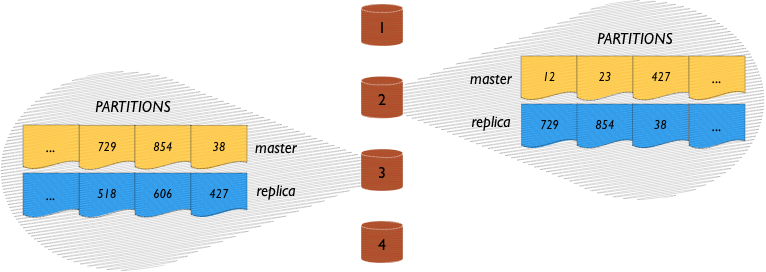

> 복제 인자는 설정 매개변수입니다. 이것은 너의 클러스터의 노드 수를 초과할 수 없습니다. 더 많은 복제본은 더 많은 확실성을 의미하지만, 쓰기 요청과 같은 클러스터에 더 높은 수요는 모든 데이터의 복제본에 가야합니다. 사실, 대부분의 배치는 복제 요소 2개로 사용합니다(하나의 마스터 복사와 하나의 복제본).

동기 복제는 즉각적인 일관성과 데이터의 손실 없음을 보장합니다. 쓰기 트랜젝션은 데이터를 커밋하고 클라이언트에 결과를 반환하기 전에 모든 복제본에 전파합니다. 클러스터가 재구성하는 드문 경우에 이것이 잠시 데이터 밖에 있기때문에 에어로스파이크 스마트 클라이언트^tm^가 잘못된 노드에 요청을 전송할때 에어로스파이크 스마트 클러스터^tm^은 확실하게 오른쪽 노드에 요청을 프록시합니다. 마지막으로, 클러스터가 분산된 후 복구할때, 이것은 데이터의 다른 복제본 사이에서 발생하는 모든 충돌을 해결합니다. 해결책은 최신 타임스탬프를 가지는 데이터가 표준이거나 데이터의 두 복사본이 더 높은 수준의 해결책을 위해 어플리케이션에 반환할 수 있는 경우에 자동으로 구성할 수 있습니다.

##### 어떻게 에어로스파이크가 파티션을 생성할지

에어로스파이크 데이터베이스의 네임스페이스는 같은 방법으로 저장되는 데이터의 컬렉션입니다. 각 네임스페이스는 4096개의 파티션으로 나뉘고 파티션은 클러스터 노드 사이에 동등하게 나뉩니다. 이것은 클러스터에 n개의 노드가 있을때, 각 노드는 데이터의 1/n까지 저장하는 걸 의미합니다.  

우리는 랜덤 해싱 방법을 파티션이 균등하게 분산되는 걸 보장하기 위해 사용합니다. 우리는 필드에 우리의 방법을 테스트해봤고 데이터는 1-2%의 오류 허용 범위내에서 고르게 분산합니다.  

데이터가 노드에 고르게(임의로) 분산되기 때문에, 한 노드가 다른 노드보다 더 많은 요청을 처리하는 핫스팟 또는 버특넥이 없습니다.  

예를들어, 미국에서, R로 시작하는 많은 성이 있습니다. 데이터가 알파벳순으로 저장되면, R로 시작하는 성을 다루는 서버는 X,Y,또는 Z로 시작하는 성을 가지는 서버보다 더 많은 트래픽을 가집니다. 데이터 임의 할당은 서버 로드가 균등한 걸 보장합니다.  

다음에, 수동 조각은 필요하지 않습니다. 클러스터의 노드는 파티션을 나누기 위해서 스스로 조정합니다. 클라이언트는 클러스터 변화를 감지하고 올바른 노드에 요청을 전송합니다. 노드가 추가되거나 제거될때, 클러스터는 자동으로 재조정합니다. 클러스터의 모든 노드는 동료입니다- 실패하고 전체 데이터베이스를 치우는 하나의 데이터베이스 마스터 노드가 없습니다.  

데이터베이스가 레코드를 생성할때, 레코드 키의 해시는 파티션에 레코드를 할당하는데 사용됩니다. 해싱은 결정적입니다-즉, 해싱 프로세스는 항상 동일한 파티션에 지정된 레코드를 맵합니다. 데이터 레코드는 그들의 전체 생활을 위해 동일한 파티션에 남아있습니다. 파티션은 하나의 서버에서 다른 서버로 이동하지만, 파티션은 기본으로 레코드를 다른 파티션에 분할 또는 재할당하지 않습니다.

> 클러스터의 각 노드는 설정 파일을 가집니다. 네임스페이스 설정 매개변수는 각 노드에 대해서 동일합니다.

##### 데이터가 어떻게 근처에 복제/동기 되는지

###### 복제 없는 에어로스파이크 클러스터

복제된 데이터의 경우를 고려해봅시다. 가장 흔한 경우는 마스터와 복제인 데이터의 두 복사본을 유지하는 것입니다. 에어로스파이크 데이터베이스에서, 이것은 복제 요소 = 2로 참고됩니다.  

이 경우에, 각 노드는 데이터의 1/4(1024 파티션)을 위한 데이터 마스터이고 각 노드는 데이터의 1/4(1024 파티션)을 위한 복제본입니다. 그래서 이것은 이것과 같습니다: (다시,간단하게 하기 위해서, 두 개의 노드를 자세하게 보여줍니다.)

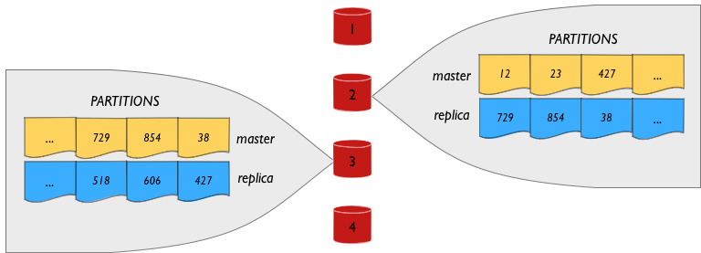

한 데이터 마스터에 대한 데이터는 복제본으로 다른 모든 노드에 분산됩니다. 즉,예를들어, 노드 #1이 데이터 마스터인 파티션은 복제에 대한 클러스터의 다른 모든 노드에 분산됩니다. 노드 #1이 사용가능하지 않은 상황에서, 노드 #1에서 데이터의 복제본은 다른 모든 노드에 분산됩니다.  

이전에 복제되지 않은 예시와 동일한 방식에서, 클라이언트는 처리하기 위해서 읽기 및 쓰기 요청을 데이터 마스터에 전송합니다.  

비 복제된 상항에서, 읽기 요청은 스마트 클라이언트에 의해서 올바른 노드에 전송됩니다. 또한 쓰기 요청도 올바른 노드에 전송됩니다. 노드가 쓰기 요청을 받을때, 이것은 데이터를 저장하고 복제 노드에 쓰기 요청을 전달합니다. 복제 노드가 그 데이터가 성공적으로 기록되고 노드가 스스로 데이터를 기록된걸 확인한후 승인은 쓰기 작업을 성공적으로 하는 클라이언트에 전송됩니다.  

> 복제 인자는 너의 클러스터의 노드수를 초과할 수 없습니다. 더 많은 복제본은 더 좋은 신뢰성을 의미하지만, 쓰기 요청과 같은 클러스터에 더 높은 요구는 모든 데이터의 복사본에 가야합니다. 사실, 대부분의 데이터베이스는 2개의 복제요소를 가집니다.

##### 자동 데이터 재조정

수동 조각이 없습니다.  

에어로스파이크의 데이터 재조정 메커니즘은 쿼리 용량이 모든 노드에 균등하게 분산되는 걸 보장합니다,그리고 스스로 재조정하는 동안에 발생하는 노드 실패의 경우를 튼튼하게합니다. 시스템은 지속적으로 사용할 수 있도록 설계되서 데이터의 재조정은 클러스터 행동에 영향을 주지 않습니다. 트랜젝션 알고리즘은 데이터 분산 시스템과 통합되고 클러스터 변화를 조정하는 유일한 합의 투표가 있습니다. 유일한 한 투표에서, 클라이언트가 새로운 클러스터 설정을 발견하는 동안에 클러스터 내부 재지시 메커니즘이 사용되는 짧은 시간이 있습니다. 따라서, ACID 특성을 유지하는 동안에 이 메커니즘은 확장가능한 조각된 환경이 없는 곳에서 트랜젝션의 단순 최적화합니다.  

에어로스파이크는 노드 사이에 데이터를 재조정하는 것과 같은 관리 작업을 위해 얼마나 사용가능한 운영 오베헤드가 사용되는지 지정하기 위해 구성 옵션을 허용합니다.(Aerospike allows configuration options to specify how much available operating overhead should be used for administrative tasks like rebalancing data between nodes as compared to running client transactions) 트랜젝션 스피드와 용량이 유지되어야 하는 예에서, 클러스터는 더 느리게 재조정합니다.  

몇가지 경우에서, 복제 요소는 충족되지 않습니다. 클러스터는 복제 요소 감소와 모든 데이터 유지 또는 처리하도록 표시된 가장 오래된 데이터 퇴거를 시작하도록 설정될 수 있습니다. 클러스터가 더 많은 데이터를 받아들일 수 없을때, 이것은 새로운 용량이 사용가능할 때까지 읽기 전용 모드에서 작업을 시작합니다- 이것이 자동으로 어플리케이션 쓰기를 받아들이는 시점에  

운영자 개입을 요구하지 않음으로써, 클러스터가 요구하는 시간에 스스로 치유합니다. 한 클러스터 배치에서, 랙 회로 브레이커는 8개의 노드 클러스터 중 하나를 제거합니다. 아무 운영자 개입은 필요하지 않습니다. 정전이 데이터 센터에 대해 절정이더라도, 트랙젝션은 완전한 ACID 충실도로 계속했습니다. 몇시간에,  실패가 올바르게 되고 고질적인 랙이 온라인으로 다시 돌아올때, 오퍼레이터는 에어로스파이크 클러스터를 유지하기 위해 특별한 단계를 수행할 필요가 없습니다.  

우리의 용량 계획과 모니터링 시스템은 너에게 서비스의 손실없이 실제로 예상치못한 실패를 처리하는 능력을 제공합니다. 너는 설정하고 하드웨어 용량을 제공하고 복제/동기화 정책을 설정하도록 데이터베이스는 유저에게 영향을 주지 않고 실패를 복구합니다.

##### 트래픽 포화 다루기

피크 트래픽 로드를 처리하기 위해 요구되는 네트워크 하드웨어의 자세한 논의는 이 문서의 범위를 초과합니다. 에어로스파이크 데이터베이스는 너한테 버틀넥을 평가하는 감시 툴을 제공합니다. 네트워크가 버틀넥일때 데이터베이스는 용량에서 실행되지 않고 요청은 느려집니다.  

##### 용량 오버플로우 다루기

우리는 용량 계획,저장소 관리 그리고 저장소가 오버플로우되지 않았다고 보장하는 클러스터 감시에 대한 제안을 많이 가집니다, 하지만 이것이 없는 경우에, 에어로스파이크는 그만 쓰기 제한에 도달합니다-더 이상 새로운 레코드를 받아들이지 않는 이 경우에. 하지만 데이터 업데이트 및 읽기는 계속 처리됩니다.  

즉, 심지어 최적 용량을 초과해도, 데이터베이스는 처리중인 요청을 중지하지 않습니다, 이것은 처리중인 사용자 요청을 유지하기 위해 가능한 대로 실행을 계속합니다.

#### 클러스터링

